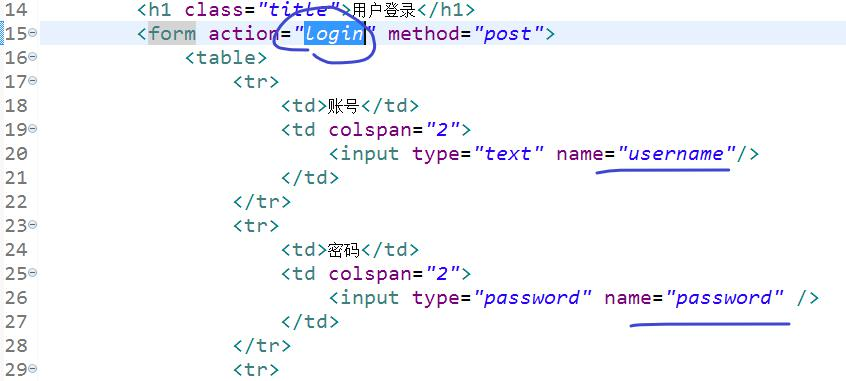
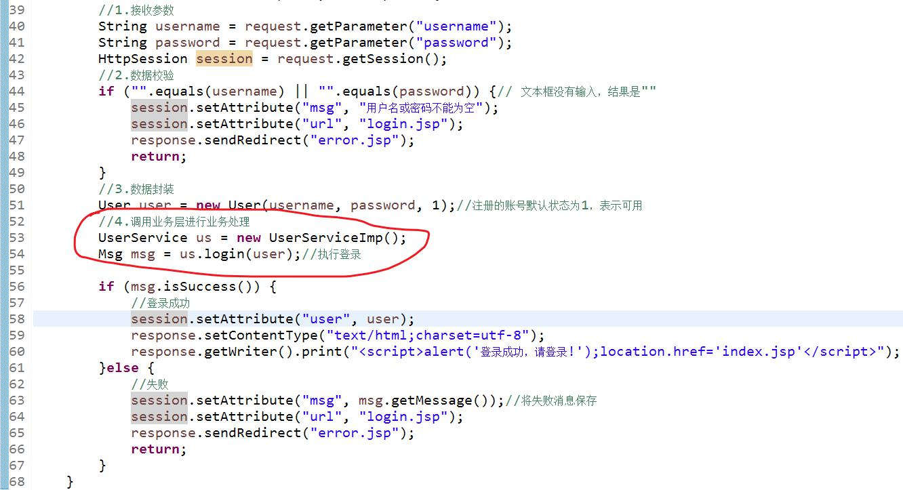
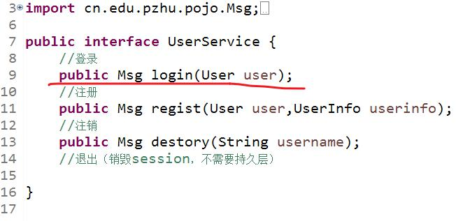
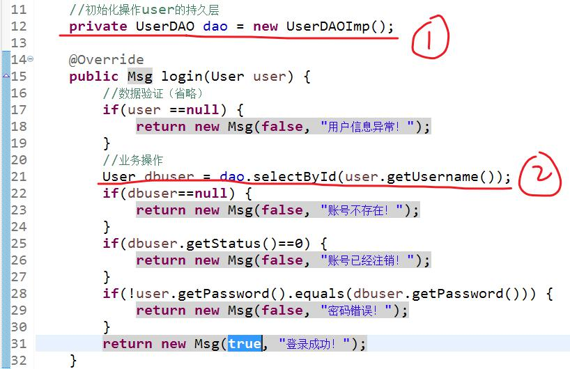
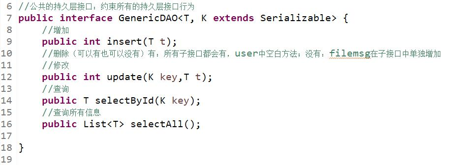
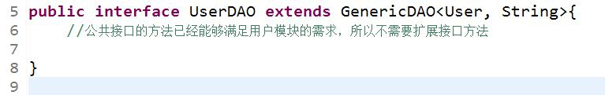
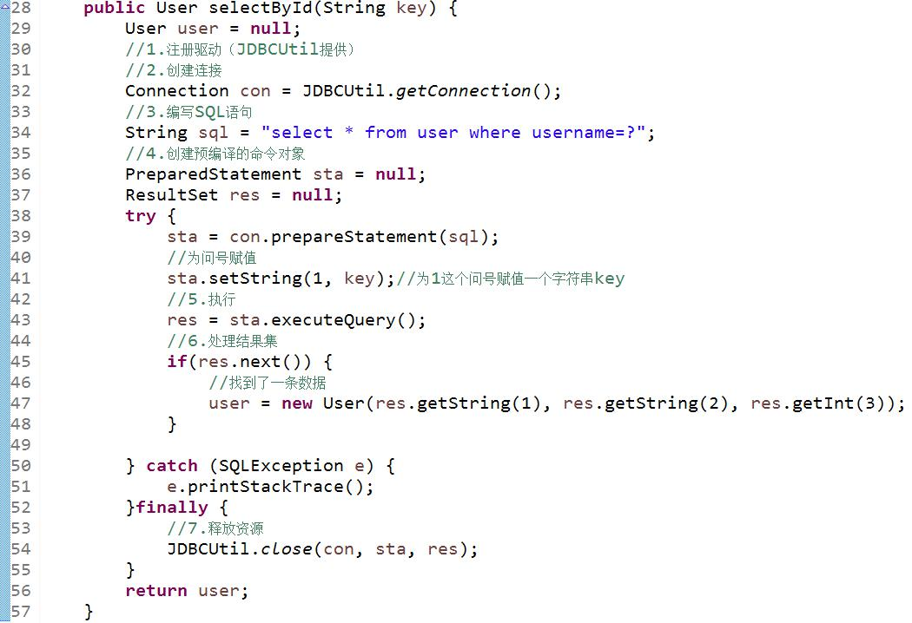

# 1. 三层架构
1. 表现层（视图+控制器）
2. 业务层（处理业务逻辑）--登录、注册
3. 持久层（操作数据库）---增删改查
# 1.1 DAO设计模式（AI：优缺点、组成、应用场景）
# 1.2 三层架构的具体组成
扩展：设计模式（23+ 单例设计模式、代理设计模式..）、软件设计原则（7个+依赖倒转）

# 2. 三层架构的实现
1-1. 表现层（JSP）

1-2. 表现层（Servlet）

2-1. 业务层（接口）

2-2. 业务层（接口的实现）

3-1.持久层接口（顶层接口，一次）

3-2.子接口（每个表一个，可以在这里扩展接口）

3-3.子接口的实现

# 3. 注册
## 1. 三层结构
1. 公共接口
2. User子接口、UserInfo子接口
3. User子接口实现、Us二Info子接口实现
4. 业务层接口（User接口、UserInfo接口）
5. 业务层接口的实现（User接口实现、UserInfo接口实现）
6. 表现层（注册控制器、注册页面）
## 2. 结构实现