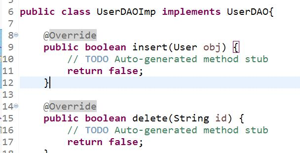

目的：提高程序可维护性，可扩展性
工程师职业素养：注意模块化，注意命名规则
# 1. 三层架构（降低耦合度）
1. 表现层（和用户进行交互--JSP、Servlet）
2. 业务逻辑层（业务处理）--高级数据处理（登录、注册、修改密码）
3. 数据访问层（对数据库进行增删改查）--低级数据处理（查询、插入、更新）
## 扩展：设计模式（20+：单例设计模式、代理设计模式、DAO设计模式...）、设计原则（7：依赖倒转）

# 2. 三层结构开发
1. 公共接口

2. 子接口（每个表都需要子接口）

3. 子接口的实现（每个接口都需要实现）

4. 业务层接口（模块）
5. 物业层接口的实现